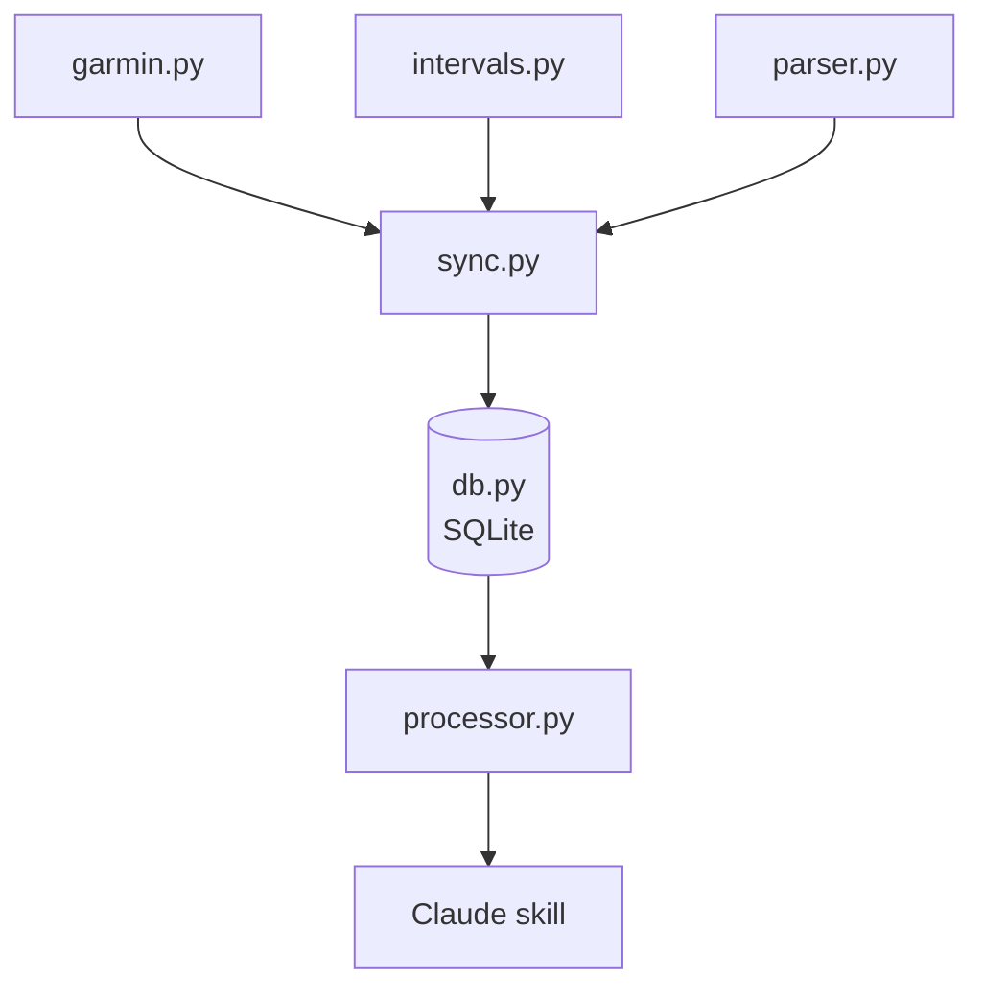

# claude-coach

A collection of Claude commands and python scripts to automate a Claude running and cycling coach with data collected on a Garmin device.

## Architecture

### Modules

| module | responsibility |
|---|---|
| `garmin.py` | fetch activities and FIT files from Garmin Connect |
| `intervals.py` | fetch activities and push planned workouts to Intervals.icu |
| `parser.py` | parse FIT files into metrics dicts |
| `sync.py` | pull from both sources, match activities, fill gaps, write to db |
| `db.py` | SQLite schema, upsert and query functions |
| `processor.py` | query db, format data as markdown tables for Claude |
